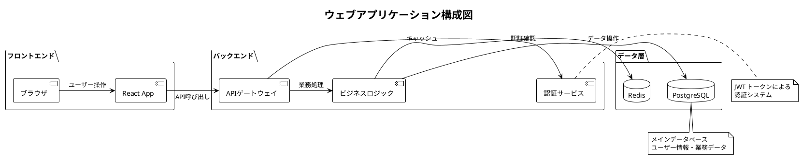
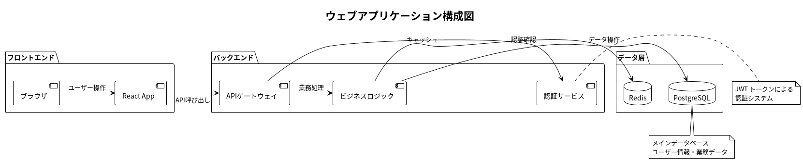

# PlantUML サンプル図

## ウェブアプリケーション構成図

このサンプルでは、典型的なウェブアプリケーションの構成要素と関連性を示しています。

### PlantUMLソースコード

[diagram_sample.puml](./diagram_sample.puml)



### 生成された図



### 図の説明

この構成図では以下の要素を表現しています：

- **フロントエンド**: ユーザーインターフェース部分
  - ブラウザ: エンドユーザーが使用するクライアント
  - React App: シングルページアプリケーション

- **バックエンド**: サーバーサイドの処理部分
  - APIゲートウェイ: フロントエンドからのリクエストを受付
  - 認証サービス: ユーザー認証とJWTトークン管理
  - ビジネスロジック: 業務処理の中核

- **データ層**: データ保存・管理部分
  - PostgreSQL: メインデータベース
  - Redis: キャッシュシステム

### 使用方法

PlantUMLファイルから画像を生成するには：

```bash
java -jar /home/user/plantuml/plantuml.jar diagram_sample.puml
```

この例は日本語フォント設定とUTF-8エンコーディングの動作確認も兼ねています。